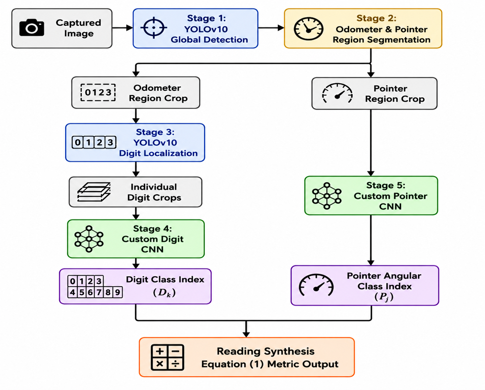

# Automated Water Meter Reading of Analogue Meters

## Overview

This repository contains the implementation of a machine learning-based system for automated reading of analogue water meters from captured images.

The proposed approach combines YOLOv10-based object detection with custom convolutional neural networks (CNNs) for odometer digit recognition and pointer angular-sector classification. The outputs from the two processing branches are combined to generate the final digital meter reading.

## System Architecture

The proposed automated meter-reading system consists of five main processing stages. A captured meter image is first processed using YOLOv10 for global detection. The detected meter is then separated into the odometer and pointer regions. The odometer branch uses YOLOv10 for individual digit localization followed by a custom CNN for digit classification, while the pointer branch uses a custom CNN to classify the pointer position into angular sectors. The outputs are finally combined through the reading-synthesis stage to produce the final meter reading.



**Figure 1.** System architecture of the proposed machine learning pipeline for automated reading of analogue water meters.

## Processing Pipeline

The system consists of the following stages:

### Stage 1: YOLOv10 Global Detection

The captured analogue water meter image is first processed using YOLOv10 to detect the relevant meter region.

### Stage 2: Odometer and Pointer Region Segmentation

The detected meter region is separated into two main components:

- Odometer region
- Pointer region

These regions are processed independently in the subsequent stages.

### Stage 3: YOLOv10 Digit Localization

The odometer region is processed using YOLOv10 to localize the individual digits displayed on the meter.

The detected digits are cropped individually and passed to the digit-recognition network.

### Stage 4: Custom Digit CNN

A custom convolutional neural network is used to classify the individual odometer digit crops into the ten digit classes:

`0, 1, 2, 3, 4, 5, 6, 7, 8, 9`

The resulting digit class indices are used to reconstruct the numerical odometer reading.

### Stage 5: Custom Pointer CNN

The pointer crop is processed using a custom CNN to classify the pointer position into predefined angular sectors.

The predicted pointer angular class is subsequently used in the reading-synthesis stage.

### Reading Synthesis

The digit-class indices and pointer angular-class prediction are combined using the reading-synthesis procedure to produce the final digital meter reading.

## Machine Learning Models

| Component | Model | Purpose |
|---|---|---|
| Global detection | YOLOv10 | Detection of the meter region |
| Digit localization | YOLOv10 | Localization of individual odometer digits |
| Digit recognition | Custom CNN | Classification of digits 0–9 |
| Pointer classification | Custom CNN | Classification of pointer angular sectors |
| Final pipeline | Integrated system | Generation of the final meter reading |

## Dataset

The study uses images of LXS-15E analogue water meters captured using a mobile phone camera.

The dataset and preprocessing procedures used for model development are described in the accompanying research work.

Raw datasets are not included in this repository unless redistribution permissions allow their public release.

## Data Augmentation

Image augmentation was applied during CNN dataset preparation to improve model generalization and provide sufficient training samples for the digit-recognition task.

The augmentation procedures and corresponding implementation are provided in the project code.

## Evaluation

The individual machine learning components and the complete meter-reading pipeline are evaluated using appropriate performance metrics.

### Object Detection

The YOLOv10 models are evaluated using:

- Precision
- Recall
- mAP@0.5
- mAP@0.5:0.95
- Confusion matrix

### CNN Classification

The CNN models are evaluated using:

- Accuracy
- Loss
- Precision
- Recall
- F1-score
- Confusion matrix

### End-to-End Evaluation

The complete pipeline is evaluated on a held-out test set using:

- Mean Absolute Error (MAE)
- Root Mean Square Error (RMSE)
- Mean Absolute Percentage Error (MAPE)
- Tolerance accuracy

## Repository Structure

The repository will contain the following main components:

```text
automated-water-meter-reading-of-analogue-meters/
│
├── README.md
├── system_architecture.png
│
├── data/
├── notebooks/
├── src/
├── models/
├── results/
└── figures/
