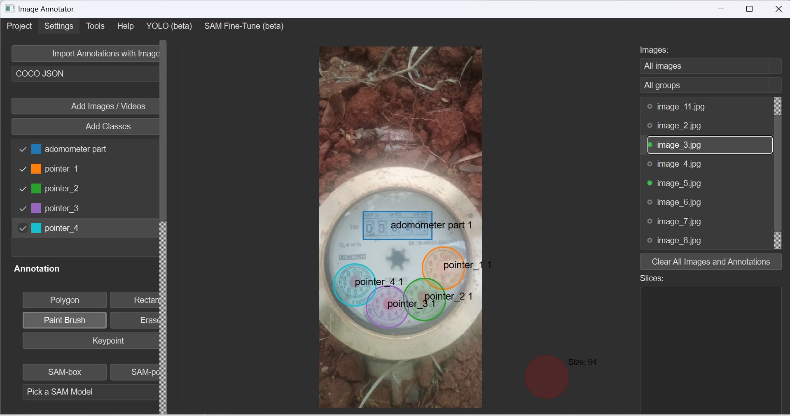

# Annotation Procedure

## Annotation Tool

Image annotation was performed using the **DigitalSreeni Image Annotator** tool.

The tool was used to prepare the annotated images required for development of the meter detection and pointer recognition models.

## Annotation Classes

The following classes were defined during the annotation process:

- `adomometer part`
- `pointer_1`
- `pointer_2`
- `pointer_3`
- `pointer_4`

## Odometer Annotation

The odometer region was annotated using the **rectangular bounding-box tool**. A rectangular region was drawn around the odometer display containing the numerical reading.

## Pointer Annotation

The pointer regions were annotated using the **Paint Brush tool**. The brush was used to mark the different pointer locations/sectors on the analogue meter.

## Annotated Sample

The following example shows the annotation procedure applied to a water-meter image. The rectangular region identifies the odometer part, while the coloured pointer annotations represent the different pointer regions.

*Figure 1. Representative annotated water-meter image showing the odometer bounding-box annotation and pointer-region annotations.*

## Annotation Workflow

The annotation procedure consisted of the following steps:

1. Load the water-meter image into the DigitalSreeni Image Annotator.
2. Define the required annotation classes.
3. Use the rectangular annotation tool to identify the odometer region.
4. Use the Paint Brush tool to mark the pointer regions.
5. Review the annotations for completeness and consistency.
6. Save the annotated images and corresponding annotations for subsequent model development.
