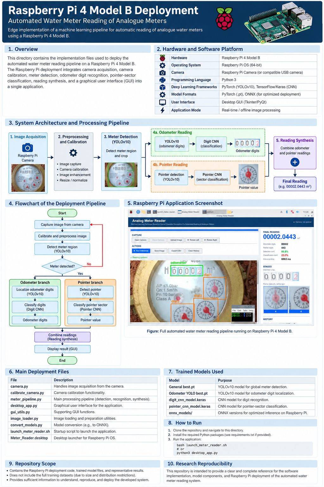
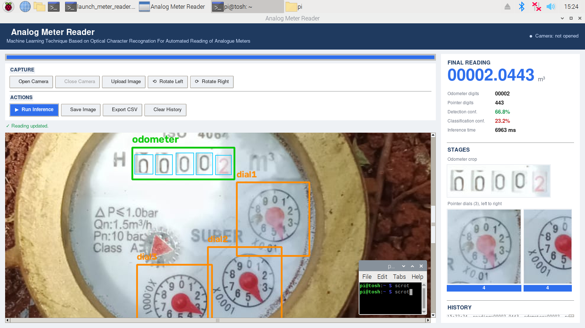

# Raspberry Pi 4 Model B Deployment

This directory contains the Raspberry Pi 4 Model B deployment of the
automated water meter reading system. It brings together image
acquisition, calibration, YOLOv10 detection, CNN-based recognition,
pointer reading, reading synthesis, and the graphical user interface.

## Deployment Platform

- **Hardware:** Raspberry Pi 4 Model B
- **Operating System:** Raspberry Pi OS
- **Camera:** Raspberry Pi-compatible camera
- **Programming:** Python 3
- **Detection:** YOLOv10
- **Recognition:** CNN-based digit and pointer classification
- **Deployment formats:** PyTorch and ONNX
- **Interface:** Desktop GUI

## System Architecture and Workflow

The complete deployment workflow is illustrated below. The system
captures an image of the analogue water meter, performs calibration
and preprocessing, detects the meter region, and then processes the
odometer and pointer through separate machine-learning branches.
Their outputs are combined to produce the final meter reading.



**Figure 1.** Complete system architecture and processing workflow of
the automated water meter reading system deployed on Raspberry Pi 4
Model B.

## Raspberry Pi Application Interface

The deployed system provides a graphical interface for capturing or
uploading meter images, running inference, viewing detected meter
regions, inspecting odometer and pointer results, and displaying the
final automated reading.



**Figure 2.** Raspberry Pi desktop application showing the automated
water meter reading interface, detected regions, intermediate results,
and final meter reading.

## Main Deployment Components

| File | Description |
|---|---|
| `camera.py` | Camera image acquisition |
| `calibrate_camera.py` | Camera calibration |
| `meter_pipeline.py` | Main detection and reading pipeline |
| `desktop_app.py` | Graphical user interface |
| `gui_utils.py` | GUI support functions |
| `image_loader.py` | Image loading and preprocessing |
| `convert_models.py` | Model conversion for deployment |
| `launch_meter_reader.sh` | Application startup script |
| `Meter_Reader.desktop` | Raspberry Pi desktop launcher |

## Trained Models

The deployment uses the trained models developed for the automated
meter-reading system:

- `General best.pt` – YOLOv10 global meter detection
- `Odometer YOLO best.pt` – YOLOv10 odometer/digit localization
- Digit CNN – odometer digit recognition
- Pointer CNN – pointer-sector classification
- ONNX models – optimized deployment versions where applicable

## How to Run

From the Raspberry Pi deployment directory:

```bash
bash launch_meter_reader.sh
